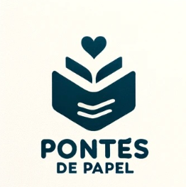

<h1 align="center">Pontes de Papel</h1>

  

O projeto "Pontes de Papel" tem como objetivo atender a demanda crescente da comunidade acadêmica por ferramentas de busca de livros acadêmicos de forma digital.

## Como usar?

O uso é simples:
1. Primeiro, uma pessoa deve cadastrar o livro em nosso site.
2. Depois do livro cadastrado, alguém com interesse no livro pode pressionar o botão "Retirar Livro" e colocar seus dados de contato.
3. Assim que os dados forem colocados, automaticamente o sistema enviará os dados para o cliente que cadastrou o livro.

## Por que usar?

1. **Redução da poluição**: O projeto visa reduzir a poluição.
2. **Auxílio à comunidade**: Auxiliamos a comunidade acadêmica.
3. **Facilidade de acesso**: Oferecemos um meio simples de conseguir novos livros.

## Tecnologias Usadas

- **HTML**
- **CSS**
- **Node.js**
- **Oracle**
- **Postgres**

## O que esperamos

Esperamos uma melhora na comunidade de leitores na Unifil, visto que esse é um hábito escasso hoje em dia.
